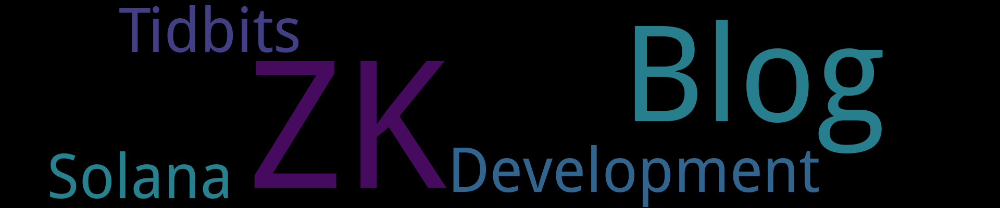

    
    
    
    

    

    

  

Blog	[1篇]

- 2024-09-20 [使用Github Issues 与 Git Action 写博客 - Hello, World!](https://github.com/SpaceStation09/my-notes/issues/1) 

            

ZK	[1篇]

- 2024-10-28 [零知识证明：R1CS 与 QAP](https://github.com/SpaceStation09/my-notes/issues/3) 

            